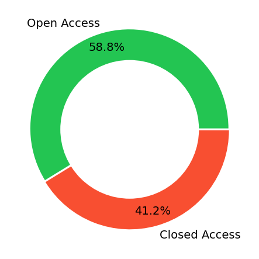
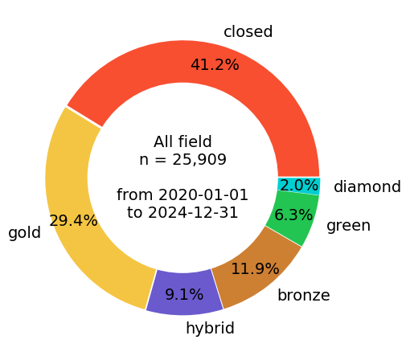

# Jupyter NotebookによるOpenAlex APIを用いた論文のオープンアクセス情報の取得と可視化

このリポジトリはOpenAlex APIを用いて特定機関の論文のオープンアクセス状況を分析・可視化するJupyter Notebookを提供します。

## 1. 概要
  
[OpenAlex API tutorial](https://docs.openalex.org/additional-help/tutorials)で公開されている以下のJupyter Notebookをオリジナルとして、その修正版を公開  
- [Monitoring Open Access publications for a given institution](https://github.com/ourresearch/openalex-api-tutorials/blob/main/notebooks/institutions/oa-percentage.ipynb)
  
### 1-1. コードの変更点

オリジナルのNotebookに対する既存の[修正リクエスト](https://github.com/ourresearch/openalex-api-tutorials/pull/11/commits/bee0bce07cd06d6f55615db8c25de9ce69926a45)(211行目)を反映  

```markdown
```diff
- if group['key'] == "true":
+ if group['key_display_name'] == "true":
```
その他の修正点:  
- 対象機関を九州大学のROR番号に変更
- フィルタリングの設定要素に領域(domain)や分野(field)、出版年の範囲指定を追加
- 分析対象にoa_statusを追加

### 1-2. Notebook

- [oa-percentage-01.ipynb](https://github.com/ashikita/openalex-api-notebook/blob/main/oa-percentage-01.ipynb)  
  is_oaを分析してOpen AcessとClosed Accessの割合を出力
- [oa-percentage-02.ipynb](https://github.com/ashikita/openalex-api-notebook/blob/main/oa-percentage-02.ipynb)  
  oa_statusを分析してOpen Accessのルート別の割合を出力

## 2. 実行方法 

次のボタンをクリックして上記のNotebookをGoogle Colab上で開き、フィルタリング設定を自由に変更して実行  

- oa-percentage-01.ipynb
[](https://colab.research.google.com/github/ashikita/openalex-api-notebook/blob/main/oa-percentage-01.ipynb)

- oa-percentage-02.ipynb
[](https://colab.research.google.com/github/ashikita/openalex-api-notebook/blob/main/oa-percentage-02.ipynb)

- oa-percentage-02r1.ipynb
[](https://colab.research.google.com/github/ashikita/openalex-api-notebook/blob/main/oa-percentage-02r1.ipynb)

- oa-percentage-02r2.ipynb
[](https://colab.research.google.com/github/ashikita/openalex-api-notebook/blob/main/oa-percentage-02r2.ipynb)



## 3. 参考

フィルタリング設定の参照先  
- [Filter works](https://docs.openalex.org/api-entities/works/filter-works)
- [openalex-topic-classification](https://github.com/ourresearch/openalex-topic-classification/tree/main?tab=readme-ov-file)  
- [OpenAlex topic mapping table](https://docs.google.com/spreadsheets/d/1v-MAq64x4YjhO7RWcB-yrKV5D_2vOOsxl4u6GBKEXY8/edit?gid=983250122#gid=983250122)  
